## 🕷️ Amazon Web Scraping Pipeline with Docker & CI/CD

### 🚀 Overview

This project enhances the original [Amazon Web Scraper CLI](https://github.com/codewithbab015/amazon-scraper-dockerized) by introducing a fully automated ETL (Extract, Transform, Load) pipeline using Docker. It scrapes Amazon product data with **Playwright**, processes it, and loads it into a **PostgreSQL** database.

The pipeline is containerized for portability and can be run either as a standalone container or orchestrated using **Docker Compose** for multi-container execution. Scraped data stored in PostgreSQL is preserved across sessions using **Docker volumes**.

#### 🧱 ETL Pipeline Architecture

```mermaid
flowchart LR
    %% Docker Compose Network
    subgraph COMPOSE[🧩<b>Docker Compose Network  </b>]

        %% ETL Container
        subgraph A[🐳 <b>ETL Container</b><br/><i>amazon-etl</i>]
            R[🚀 <b>run_script.py</b><br/><i>Entrypoint</i>]
            R --> E1[📥 <b>Extract</b><br/><i>Data Ingestion</i>]
            R --> E2[⚙️ <b>Transform</b><br/><i>Data Cleaning</i>]
            R --> E3[📤 <b>Load</b><br/><i>To DB or Dir</i>]
        end
        %% Database Container
        subgraph B[🐘 <b>PostgreSQL</b><br/><i>Database Service</i>]
            DB[(🗄️ <b>postgres-db</b>)]
        end

        %% Volume
        subgraph V[🗂️ <b>Volume</b><br/><i>Shared File Storage</i>]
            VOL[(📦 <b>Mounted Volume</b>)]
        end

        %% Data Flow
        E1 --> JSON[📄 <b>Raw JSON</b>]
        E2 --> CLEAN[✨ <b>Clean Dataset</b>]
        E3 --> DB
        E3 --> VOL
    end

    %% Styling
    classDef container fill:#ede7f6,stroke:#7b1fa2,stroke-width:2px,color:#4a148c,font-weight:bold
    classDef db fill:#e3f2fd,stroke:#1565c0,stroke-width:2px,color:#0d47a1
    classDef volume fill:#f1f8e9,stroke:#33691e,stroke-width:2px,color:#1b5e20
    classDef process fill:#fff3e0,stroke:#ef6c00,stroke-width:2px,color:#e65100
    classDef output fill:#fce4ec,stroke:#ad1457,stroke-width:2px,color:#880e4f

    class A,R,E1,E2,E3 container
    class B,DB db
    class V,VOL volume
    class JSON,CLEAN,DB,VOL output
```

---

### 🛠️ Project Guidelines

This pipeline builds upon the [Amazon Web Scraper CLI](https://github.com/codewithbab015/amazon-scraper-dockerized) by dockerizing all ETL stages. The pipeline is executed using the `run_script.py` entrypoint, which supports running each stage independently.

Each stage accepts specific arguments, as outlined below:


#### ✅ Stage 1: Extract

Scrapes product listing data from Amazon.

**Required arguments:**

- `RUN_GROUP`: Main product category (refer to `configs.yml`)
- `RUN_NAME`: Subcategory associated with the `RUN_GROUP`
- `RUN_MODE`: Must be set to `extract`
- `MAX`: Number of pages to scrape (must be ≥ 1)


#### 🔄 Stage 2: Transform

Processes and enriches the extracted data.

**Required arguments:**

- `RUN_GROUP`: Main product category
- `RUN_NAME`: Product subcategory
- `RUN_MODE`: Must be set to `transform`


#### 📦 Stage 3: Load

Cleans and stores data either locally or in a PostgreSQL database.

**Required arguments:**

- `RUN_GROUP`: Main product category
- `RUN_NAME`: Product subcategory
- `RUN_MODE`: Must be set to `load`
- `DESTINATION`: Indicates the storage destination:
  - `dir`: Save data locally to the project directory
  - `db`: Load data into the PostgreSQL database

The pipeline automatically handles the chosen destination (`dir` or `db`) based on this configuration.


#### 🧾 Script Summary

| Stage | Script                           | Description                                                    |
|-------|----------------------------------|----------------------------------------------------------------|
| 1     | `extract/scraper_extractor.py`   | Scrapes summary-level product data and saves it as JSON        |
| 2     | `transform/scraper_transform.py` | Transforms and enriches the data based on Step 1 output        |
| 3     | `load/scraper_load.py`           | Cleans and loads the data into a local directory or PostgreSQL |

---

### 🐳 Docker Execution Commands for the Project

This project is executed using a [`Taskfile`](https://taskfile.dev) as defined in the project structure. The `Taskfile` provides a clean and rich CLI interface, allowing you to unify dependent Docker and command-line instructions into a single, maintainable file.

#### ⚙️ Prerequisites

Before running the project, ensure the following tools are installed:

- 🐳 [Docker](https://www.docker.com/)
- 📦 [Docker Compose](https://docs.docker.com/compose/install/)
- 🐍 (Optional for development) Python 3.8+ with a virtual environment for manual debugging


#### 📁 Clone the Repository

```bash
git clone https://github.com/your-username/amazon-scraper-dockerized.git
cd amazon-scraper-dockerized
```

#### ▶️ Option 1: Run Docker Standalone

> Recommended for executing a single-stage task (e.g., `extract`, `transform`, or `load`).

##### 🔐 1. Login to Docker Hub

```bash
# Log in to Docker Hub
task docker:docker-login
```

##### 🏗️ 2. Build Docker Image Locally

```bash
# Build Docker Image and Load to Daemon
task docker:local-build \
  DOCKER_USER=<your-dockerhub-username> \
  IMAGE_NAME=amazon-scraper-cli \
  VERSION=latest

# <Optional Commands>
# List all Docker images on your system
docker images

# View currently running Docker containers
docker ps

# View all containers (including stopped ones)
docker ps -a

# Remove all unused Docker images (dangling and untagged)
docker image prune -a

# Remove all unused Docker volumes
docker volume prune

# Remove all stopped containers
docker container prune

# Remove a specific container by name or ID
docker rm <container_id_or_name>

# View logs from a specific running container
docker logs <container_id_or_name>

# Stop a specific running container
docker stop <container_id_or_name>

```

##### 📤 3. Push Image to Docker Hub (Optional)

```bash
task docker:local-remote \
  DOCKER_USER=<enter your Docker Hub username> \
  IMAGE_NAME=amazon-scraper-cli \
  VERSION=latest
```

##### 🔁 4. Build and Push Image to Docker Hub (Optional)

```bash
task docker:remote-build \
  DOCKER_USER=<enter your Docker Hub username> \
  IMAGE_NAME=amazon-scraper-cli \
  VERSION=latest
```
##### 🚀 5. Run Docker Container: Store Data Locally

```bash
# DOCKER_USER, IMAGE_NAME, and VERSION can be set as defaults in ./taskfiles/Dockerfile.yml
# Change RUN_GROUP, RUN_TYPE, and RUN_MODE as required

# Step 1: Extract data and store it as JSON locally
task docker:run-job \
  DOCKER_USER=<your-dockerhub-username> \
  IMAGE_NAME=amazon-scraper-cli \
  VERSION=latest \
  RUN_GROUP=electronics \
  RUN_TYPE=camera-photo \
  RUN_MODE=extract \
  MAX=1

# Step 2: Transform the extracted data and store it as JSON locally
task docker:run-job \
  DOCKER_USER=<your-dockerhub-username> \
  IMAGE_NAME=amazon-scraper-cli \
  VERSION=latest \
  RUN_GROUP=electronics \
  RUN_TYPE=camera-photo \
  RUN_MODE=transform

# Step 3: Load the transformed data into the local file system
# Use DESTINATION=db if loading into a database (via Docker Compose or Kubernetes)
task docker:run-job \
  DOCKER_USER=<your-dockerhub-username> \
  IMAGE_NAME=amazon-scraper-cli \
  VERSION=latest \
  RUN_GROUP=electronics \
  RUN_TYPE=camera-photo \
  RUN_MODE=load \
  DESTINATION=dir
```

#### 🐳 Pulling the Deployed Docker Image

Use the following command to pull the Docker image from the registry. This image can be used for:

- Local testing using Docker or Docker Compose
- Deployment as a microservice in a Kubernetes environment

> All procedures can also be automated and demonstrated using a CI/CD tool such as Jenkins.

```bash
docker pull mrbaloyin/amazon-web-scraper-cli:latest

```